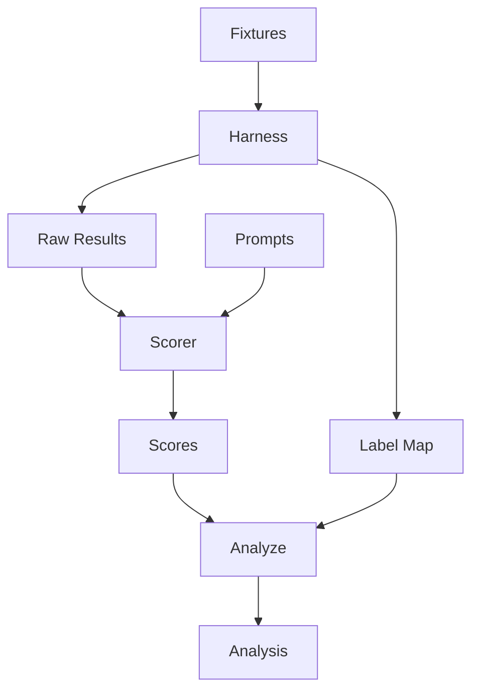

<div align="center">

# MCP Parameter-Description Ablation

[](LICENSE)
[](experiments/exp1-analyze-symbol/analysis.json)

Does moving parameter-level detail out of an MCP tool's description string and into
`inputSchema.properties[*].description` regress parameter-filling accuracy -- especially for
smaller models?

Supplementary data repository for an MCP parameter-description ablation experiment. Companion
blog post: TBD.

</div>

## Status

**Result: null for both models.** The full 320-call run (`recipe/harness.py`) executed and
was blind-scored (`recipe/scorer.py`, `recipe/analyze.py`; see
[PR #10](https://github.com/clouatre-labs/param-description-experiments/pull/10)). The
pre-registered primary test -- Mann-Whitney U, cell C (lean tool description, current
production text) vs cell A (rich tool description, constructed pre-#593-style baseline),
param-fill score, two-tailed alpha=0.05, per model -- found no significant difference:

*Table 1: Mann-Whitney U results per model, primary comparison (cell C, lean description, vs
cell A, rich description), param-fill score, two-tailed alpha=0.05, n=40 per cell.*

| Model | U | p | r | n/cell |
|---|---|---|---|---|
| claude-haiku-4-5-20251001 | 720 | 0.372 | 0.10 | 40 |
| claude-sonnet-5 | 820 | 0.569 | -0.025 | 40 |

No detectable parameter-filling regression from moving `analyze_symbol`'s param detail out of
the tool description and into `inputSchema.properties[*].description`, for either model.
Exploratory data (cells B/D, tool-selection accuracy, serialized tools-list token cost) is in
[`experiments/exp1-analyze-symbol/analysis.json`](experiments/exp1-analyze-symbol/analysis.json).

One documented gap: the `hallucinated-default` score category has no formal definition in
`protocol.md`/`rubric.md`; the operational definition used by the scorer is documented in
[`experiments/exp1-analyze-symbol/scorer-prompt.md`](experiments/exp1-analyze-symbol/scorer-prompt.md).

This matches the pre-registration discipline of
[`clouatre-labs/prompt-repetition-experiments`](https://github.com/clouatre-labs/prompt-repetition-experiments),
this repo's structural template.

## Pipeline



*Figure 1: Run pipeline. The harness (`recipe/harness.py`) writes blind per-call results to
`raw/<run_id>.json` and separately seals `label-map.json`. The scorer (`recipe/scorer.py`)
reads only `raw/` and `prompts.json` and never `label-map.json`, writing `scores.json`. The
analyze step (`recipe/analyze.py`) is the first stage to join `scores.json` with
`label-map.json`, producing `analysis.json` and the results table above.*

## Structure

See [`docs/architecture.md`](docs/architecture.md) for the full 2x2 design and the
blinding-boundary diagram.

- `recipe/harness.py` -- calls the Anthropic Messages API for every (cell, model, prompt,
  run) combination, writes anonymized `run_id` results to `raw/`, seals `label-map.json`.
- `experiments/exp1-analyze-symbol/`
  - `protocol.md` -- frozen design and run parameters
  - `rubric.md` / `prompts.json` -- the 8 pre-registered prompts and expected-JSON rubric
  - `fixtures/cell-{a,b,c,d}.json` -- the four `analyze_symbol` tool-description/param-doc
    variants under test, pinned to aptu-coder `v0.32.5` (commit `21a875b`)
  - `fixtures/distractors.json` -- the `analyze_directory`/`analyze_file` selection-accuracy
    distractor tools, same pin
  - `raw/` -- per-call results, named by opaque `run_id` (blind to cell/model/prompt)
  - `label-map.json` -- sealed `run_id -> {cell, model, prompt_id, run_index}` mapping,
    joined in only after scoring

## Running the harness

```sh
uv run recipe/harness.py --experiment experiments/exp1-analyze-symbol --dry-run
uv run recipe/harness.py --experiment experiments/exp1-analyze-symbol --smoke-test
uv run recipe/harness.py --experiment experiments/exp1-analyze-symbol --pilot
uv run recipe/harness.py --experiment experiments/exp1-analyze-symbol --confirm-full-run
```

`ANTHROPIC_API_KEY` must be set in the environment for `--smoke-test`, `--pilot`, and
`--confirm-full-run`. `OPENROUTER_API_KEY` is a credentialed alternative
(`ANTHROPIC_API_KEY` still takes priority if both are set): OpenRouter's `/v1/messages`
route returns the native, first-party Anthropic Messages API response shape, not an
OpenAI-format translation, so results are not a calling-path confound. Under OpenRouter,
`--confirm-full-run` defaults to OpenRouter's async Batch API; the 24-hour window
documented by OpenRouter is a ceiling, not an estimate -- for this run's size
(~160 requests/model) typical completion is well under an hour. Pass `--sync` to
`--confirm-full-run` to force the synchronous per-call path instead of the batch API
(useful when the batch API is unavailable or undesirable); `--sync` is a no-op under
`ANTHROPIC_API_KEY`, which is already synchronous. `--pilot` runs exactly one call per
(cell, model) pair (8 calls) synchronously to `raw/pilot/`, outside the sealed run, as a
cheap sanity check of the full grid before committing to `--confirm-full-run`.

## License

Apache-2.0.
