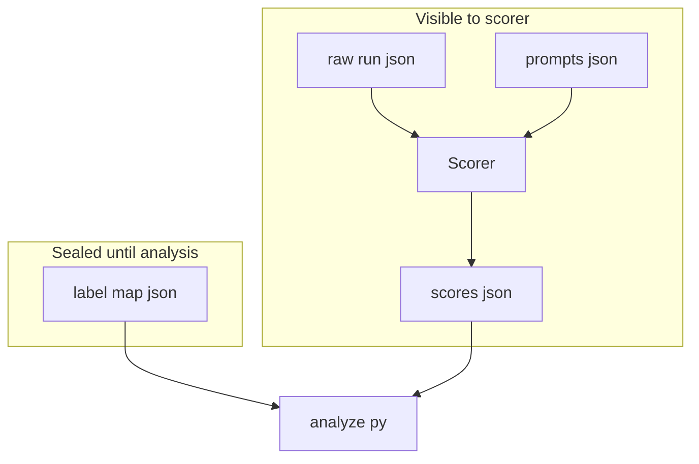

# Architecture: exp1-analyze-symbol

This doc describes the experiment's structural design (the 2x2 cell design) and the
blind-scoring boundary between the scorer and the run's labeling metadata. For full frozen
run parameters, see `experiments/exp1-analyze-symbol/protocol.md`; for scoring definitions
and per-prompt expected values, see `experiments/exp1-analyze-symbol/rubric.md`.

## Cell Design

*Table 1: the 2x2 cell design crossing tool-description verbosity against parameter-description
verbosity; the primary comparison is C vs A.*

| | Param descriptions: rich | Param descriptions: sparse |
|---|---|---|
| **Tool description: rich** | A (baseline) | B |
| **Tool description: lean** | C (target) | D (worst case) |

## Blind-Scoring Boundary

*Figure 1: the scorer only ever reads the raw tool call and the expected prompt values; it
never sees which cell or model produced a run until `label-map.json` is joined in during the
`recipe/analyze.py` step, after scoring is complete.*

## See also

- `experiments/exp1-analyze-symbol/protocol.md`
- `experiments/exp1-analyze-symbol/rubric.md`
